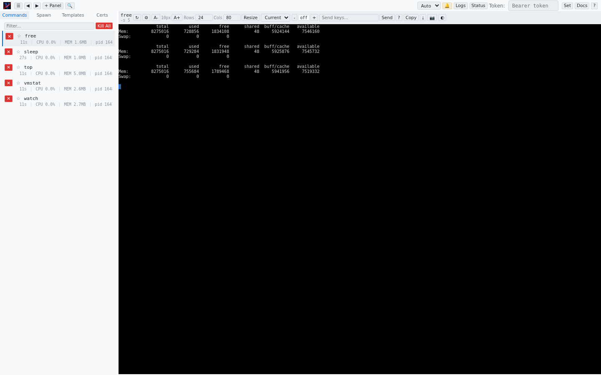

# vrc / vrw

A virtual terminal runner and process orchestrator. Run commands in pseudo-terminals, monitor them through a local terminal display or a web dashboard, and control them via Unix Domain Socket or HTTP API — from a single statically-linked binary with under 5ms startup.



This repository contains two binaries built from a shared codebase, selected at compile time via Cargo features:

| Binary | Feature Flag | IPC Mechanism | Target Use Case |
|--------|-------------|---------------|-----------------|
| **vrc** | `vrc` (default) | Unix Domain Sockets | Lightweight local CLI tooling, scripts, pipelines |
| **vrw** | `vrw` | HTTP + WebSocket | Remote access, web dashboard, multi-user scenarios |

Both binaries share the same VTTY emulator, process manager, configuration system, interactive display, and handle infrastructure. They differ only in how clients communicate with running instances: **vrc** uses UDS IPC for local-only communication, while **vrw** exposes a full HTTP API with an embedded web admin UI.

## Features

### Shared (both binaries)

- **Interactive Display** — Full terminal UI with tab bar, search, copy/paste, split-pane, and scrollback navigation
- **Daemon Mode** — Background execution with double-fork, detachable from the terminal
- **Multi-Instance** — Run multiple instances, discover and manage them from the CLI
- **Configuration** — YAML/TOML/JSON with 3-layer precedence, named profiles, environment variable control
- **Advanced VTTY** — Scrollback, search, mouse support, alternate screen, 256/truecolor
- **Process Control** — Freeze/thaw (SIGSTOP/SIGCONT), graceful shutdown with timeouts, exit handlers, per-command retain/snapshot on exit, initial keystroke injection

### vrc-specific

- **UDS IPC** — All inter-instance communication uses Unix Domain Sockets with length-prefixed JSON protocol. No HTTP server, no network binding, no TLS overhead. Sockets use `0600` permissions for filesystem-based security.

### vrw-specific

- **HTTP API** — RESTful API for spawning commands, sending keystrokes, reading VTTY output, managing certificates, and streaming logs
- **Web Admin Dashboard** — Embedded single-page application served at `/admin` with real-time VTTY viewer, command management, theme switching, search, and keyboard shortcuts
- **WebSocket Streaming** — Incremental diff protocol for efficient real-time terminal updates and log streaming
- **TLS / Remote Access** — Optional TLS encryption with auto-generated self-signed certificates, bearer token authentication, and CORS configuration
- **Certificate-Based Access Control** — Per-command certificate pool for fine-grained client authorization
- **Screenshot Rendering** — Server-side PNG rendering of terminal output via the API

## Quick Start

> **Requires Rust 1.75+** (edition 2021). Install via [rustup](https://rustup.rs/) if needed.

### Building vrc (default)

```bash
git clone https://github.com/nkh/K.git
cd K
cargo build --release
# Binary at target/release/vrc
```

### Building vrw

```bash
git clone https://github.com/nkh/K.git
cd K
cargo build --release --features vrw
# Binary at target/release/vrw
```

### Building both

```bash
cargo build --release --features "vrc,vrw"
# Both binaries at target/release/vrc and target/release/vrw
```

### Using vrc

```bash
# Run a command
vrc -- htop

# Run with local terminal display
vrc --display -- htop

# Keep display open after command exits (monitor mode, equivalent to old --display-all)
vrc --display -- npm run dev

# Send initial keystrokes and retain buffer after exit
vrc --retain-on-exit --send-keys "ls<Enter>" -- bash

# Run as a background daemon
vrc --daemon -- npm run dev

# List running instances
vrc list

# Interactively select an instance to inspect
vrc list -i

# Freeze a command (interactive selection)
vrc freeze -i

# Cat a command's output (interactive selection)
vrc cat -i

# Kill a command inside a running instance
vrc kill 12345

# Kill a command interactively
vrc kill -i

# Stop all commands and exit
vrc kill --all

# Stop an instance
vrc stop <pid>
```

### Using vrw

```bash
# Start the server (HTTP on port 9090)
vrw

# Start with a command at launch
vrw -- htop

# Open the web dashboard
# Navigate to http://127.0.0.1:9090/admin

# Spawn a command via CLI
vrw spawn htop

# Spawn via API
curl -X POST http://127.0.0.1:9090/api/commands \
  -H "Content-Type: application/json" \
  -d '{"cmd": "htop", "args": []}'

# Interactive selection for freeze/thaw/resize/cat/screenshot
vrw freeze -i
vrw cat -i
vrw screenshot -i

# Stop a running command
vrw stop-command htop

# Alias: vrw kill
vrw kill htop

# Stop all commands and exit
vrw kill --all

# Enable TLS and remote access
vrw --remote --tls -- my-command
```

## Installation

### From Source (vrc)

```bash
git clone https://github.com/nkh/K.git
cd K
cargo build --release --features vrc
# Binary at target/release/vrc
```

### From Source (vrw)

```bash
git clone https://github.com/nkh/K.git
cd K
cargo build --release --features vrw
# Binary at target/release/vrw
```

### System-Wide Install (vrc)

```bash
cargo install --path . --features vrc
```

### System-Wide Install (vrw)

```bash
cargo install --path . --features vrw
```

### Man Pages

```bash
# vrc
cp man/vrc.1 /usr/local/share/man/man1/
man vrc

# vrw
cp man/vrw.1 /usr/local/share/man/man1/
man vrw
```

### Shell Completions

Both `vrc` and `vrw` support tab completion for commands, options, and arguments. Completions are generated on-demand and can be installed for your shell:

**Bash:**
```bash
vrc completions bash > /etc/bash_completion.d/vrc
vrw completions bash > /etc/bash_completion.d/vrw
```

**Zsh:**
```bash
vrc completions zsh > ~/.zsh/completions/_vrc
vrw completions zsh > ~/.zsh/completions/_vrw
```

**Fish:**
```bash
vrc completions fish > ~/.config/fish/completions/vrc.fish
vrw completions fish > ~/.config/fish/completions/vrw.fish
```

**PowerShell:**
```powershell
vrc completions powershell > vrc.ps1
vrw completions powershell > vrw.ps1
# Then dot-source: . ./vrc.ps1
```

**Elvish:**
```bash
vrc completions elvish > ~/.config/elvish/lib/vrc.elv
vrw completions elvish > ~/.config/elvish/lib/vrw.elv
```

After installing, restart your shell or source your configuration file to activate completions.

## Documentation

Documentation is organized using the [Diataxis framework](https://diataxis.fr/) into four quadrants. Start at the **[documentation index](docs/index.md)** to find what you need.

| Quadrant | Description | Start here |
|----------|-------------|------------|
| [Tutorials](docs/tutorials/getting-started.md) | Hands-on lessons for new users | Lesson 1: Your First Command |
| [How-To Guides](docs/how-to-guides/) | Task-oriented recipes for specific goals | Pick the task you want |
| [Reference](docs/configuration.md) | Authoritative specs: config, CLI, protocol | Look up a value |
| [Explanation](docs/explanation/architecture.md) | Concepts, architecture, design decisions | Understand why |

**Other resources:**

| Document | Description |
|----------|-------------|
| [FAQ](docs/faq.md) | Frequently asked questions |
| [User Manual](MANUAL.md) | Comprehensive all-in-one reference (includes [Display Modes](MANUAL.md#210-display-modes)) |
| [docs/examples/](docs/examples/) | Complete example configuration files |
| [man/vrc.1](man/vrc.1) | vrc Unix manpage |
| [man/vrw.1](man/vrw.1) | vrw Unix manpage |

## Architecture

Both binaries are built from the `vrc_core` library crate. The `vrc` feature is the default and compiles only the UDS IPC path. The `vrw` feature additionally pulls in the HTTP stack (Axum, reqwest, rustls, rust-embed) and the embedded web admin UI.

Shared modules (available to both binaries): `cli/`, `config/`, `daemon/`, `handles/`, `hooks/`, `instance/`, `interactive/`, `ipc/`, `logging/`, `process/`, `vtty/`.

vrc-specific: `ipc/` (UDS server/client).

vrw-specific: `web/` (HTTP server, REST handlers, WebSocket, TLS, auth, static assets).

For the full architecture overview, see [docs/explanation/architecture.md](docs/explanation/architecture.md).

## License

Dual-licensed under **GPL-3.0-or-later** or **Artistic-2.0** — see [LICENSE](LICENSE) for the full text.
