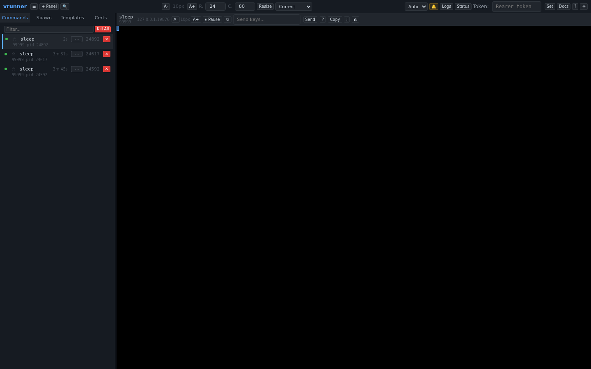

# vrunner Documentation

A virtual terminal runner with web control plane.

## Overview

## Where to Start

| You want to... | Read this first |
|----------------|-----------------|
| Learn vrunner from scratch | [Getting Started](tutorials/getting-started.md) |
| Run your first command in 5 minutes | [Getting Started, Lesson 1](tutorials/getting-started.md#lesson-1-your-first-command) |
| Set up a dev server dashboard | [Development Server](how-to-guides/dev-server.md) |
| Look up a config option | [Configuration](reference/configuration.md) |
| Find an API endpoint | [API Reference](reference/api.md) |
| Understand the architecture | [Architecture](explanation/architecture.md) |
| Compare vrunner with tmux | [Comparison](explanation/comparison.md) |
| Troubleshoot a problem | [FAQ](faq.md) |

## Document Index

### Tutorials
| Document | Description |
|----------|-------------|
| [Getting Started](tutorials/getting-started.md) | Lessons 1-15: install, first command, web UI, API, config, display, TLS |

### How-To Guides
| Document | Description |
|----------|-------------|
| [Running Commands](how-to-guides/running-commands.md) | Spawn commands via CLI, web UI, and API |
| [Web Dashboard](how-to-guides/web-dashboard.md) | Navigate and use the admin interface |
| [REST API](how-to-guides/api-usage.md) | Programmatic control with curl and scripts |
| [Configuration Profiles](how-to-guides/configuration-profiles.md) | Named presets for dev, staging, production |
| [Remote TLS](how-to-guides/remote-tls.md) | Secure remote connections with TLS |
| [Daemon Mode](how-to-guides/daemon-mode.md) | Run vrunner as a background service |
| [Certificate Management](how-to-guides/certificates.md) | Per-command access control with named certificates |
| [CI/CD Pipeline](how-to-guides/ci-pipeline.md) | Integrate vrunner into build pipelines |
| [Development Server](how-to-guides/dev-server.md) | Monitor frontend, backend, and DB from one dashboard |
| [Multi-Service](how-to-guides/multi-service.md) | Run and monitor multiple production services |
| [Pair Programming](how-to-guides/pair-programming.md) | Share terminal sessions between developers |
| [Interactive Display](how-to-guides/interactive-display.md) | Local TUI with tabs, search, split-pane, mouse support |
| [Snapshots and Diffs](how-to-guides/snapshots-diffs.md) | Capture and compare terminal state |
| [Environment Variables](how-to-guides/environment-variables.md) | Three-layer environment variable control |
| [Event Hooks](how-to-guides/hooks.md) | Run shell commands on spawn, exit, error, kill events |

### Reference
| Document | Description |
|----------|-------------|
| [Configuration](reference/configuration.md) | All config fields, CLI flags, types, defaults, and precedence |
| [CLI Reference](reference/cli.md) | All flags, subcommands, and key notation |
| [API Reference](reference/api.md) | Complete REST API endpoint reference |
| [WebSocket Protocol](reference/websocket.md) | VTTY and log streaming message formats |
| [Keybindings](reference/keybindings.md) | Default and customizable keyboard shortcuts |

### Explanation
| Document | Description |
|----------|-------------|
| [Architecture](explanation/architecture.md) | System design, module breakdown, data flow, concurrency model |
| [Comparison](explanation/comparison.md) | Feature matrix: vrunner vs tmux, screen, mprocs, gotty, wetty |
| [Incremental Diff Protocol](explanation/incremental-diff.md) | Bandwidth-optimized VTTY streaming |
| [Security Model](explanation/security-model.md) | Authentication, TLS, certificate-based access control |
| [Lifecycle Policy](explanation/lifecycle-policy.md) | Start, retain, and exit behavior |

### Web UI Reference
| Document | Description |
|----------|-------------|
| [Overview](web-ui/overview.md) | UI layout and navigation |
| [Top Bar](web-ui/topbar.md) | Controls, theme, font size, resize |
| [Sidebar](web-ui/sidebar.md) | Command list, spawn, templates, certs |
| [Panel Header](web-ui/panel-header.md) | Per-panel controls and send-keys |
| [Terminal View](web-ui/terminal-view.md) | VTTY display and interaction |
| [Send Keys](web-ui/send-keys.md) | Sending keystrokes to terminals |
| [Special Keys](web-ui/special-keys.md) | Key notation reference |
| [Log Viewer](web-ui/log-viewer.md) | Real-time log streaming |
| [Global Search](web-ui/global-search.md) | Searching across all command output |
| [Context Menu](web-ui/context-menu.md) | Right-click actions |
| [Themes](web-ui/themes.md) | Dark, light, grey, and per-panel themes |
| [Keyboard Shortcuts](web-ui/shortcuts.md) | All keyboard shortcuts |

### Cookbook
| Document | Description |
|----------|-------------|
| [CI Pipeline](cookbook/ci-pipeline.md) | End-to-end CI/CD integration |
| [Remote TLS](cookbook/remote-tls.md) | Complete TLS setup walkthrough |
| [Multi-Service](cookbook/multi-service.md) | Multi-instance monitoring |
| [Pair Programming](cookbook/pair-programming.md) | Collaborative sessions |
| [Development Server](cookbook/dev-server.md) | Full-stack dev dashboard |

### Other
| Document | Description |
|----------|-------------|
| [FAQ](faq.md) | Frequently asked questions |
