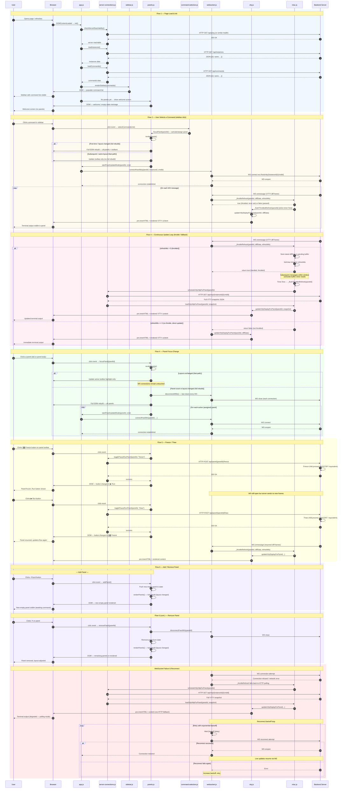

```mermaid
sequenceDiagram
    autonumber

    participant User
    participant Browser
    participant app.js
    participant server-connections.js
    participant sidebar.js
    participant panels.js
    participant command-selection.js
    participant websocket.js
    participant vtty.js
    participant misc.js
    participant Backend Server

    %% =========================================================================
    %% FLOW 1: Page Load & Init
    %% =========================================================================
    rect rgb(240, 248, 255)
    note over User, Backend Server: Flow 1 — Page Load & Init
    User->>Browser: Opens page / refreshes
    Browser->>app.js: DOMContentLoaded → init()
    app.js->>server-connections.js: checkServerReachability()
    server-connections.js->>Backend Server: HTTP GET /api/ping (or similar health)
    Backend Server-->>server-connections.js: 200 OK
    server-connections.js-->>app.js: server reachable

    app.js->>server-connections.js: loadInstances()
    server-connections.js->>Backend Server: HTTP GET /api/instances
    Backend Server-->>server-connections.js: JSON [{id, name, ...}]
    server-connections.js-->>app.js: instances data

    app.js->>server-connections.js: loadCommands()
    server-connections.js->>Backend Server: HTTP GET /api/commands
    Backend Server-->>server-connections.js: JSON [{id, name, ...}]
    server-connections.js-->>app.js: commands data

    app.js->>sidebar.js: renderSidebar(commands)
    sidebar.js->>Browser: DOM — populate command list
    Browser-->>User: Sidebar with command list visible

    app.js->>panels.js: No panels yet → show welcome screen
    panels.js->>Browser: DOM — welcome / empty-state message
    Browser-->>User: Welcome screen (no panels)
    end

    %% =========================================================================
    %% FLOW 2: User Selects a Command
    %% =========================================================================
    rect rgb(255, 250, 240)
    note over User, Backend Server: Flow 2 — User Selects a Command (sidebar click)

    User->>Browser: Clicks command in sidebar
    Browser->>command-selection.js: click event → selectCommand(cmd)
    command-selection.js->>panels.js: focusPanel(panelId) — activate/assign panel
    panels.js->>panels.js: renderPanels()
    alt First time / layout changed (full rebuild)
        panels.js->>Browser: Full DOM rebuild — all panels + toolbars
    else Subsequent / same layout (fast-path)
        panels.js->>Browser: Update toolbar only (no full rebuild)
    end

    panels.js->>app.js: startPanelUpdateMode(panelId, cmd)
    app.js->>websocket.js: connectPanelWs(panelId, instanceId, cmdId)
    websocket.js->>Backend Server: WS connect ws://host/vtty/{instanceId}/{cmdId}
    Backend Server-->>websocket.js: WS onopen
    websocket.js-->>app.js: connection established

    loop On each WS message
        Backend Server->>websocket.js: WS onmessage (VTTY diff frame)
        websocket.js->>misc.js: _throttleRefresh(panelId, diffData, refreshMs)
        misc.js-->>websocket.js: true (throttled, timer set) or false (passed)
        misc.js->>vtty.js: _flushThrottledRefresh(panelId) [when timer fires]
        vtty.js->>vtty.js: updateVttyDisplayForPanel(panelId, diffData)
        vtty.js->>Browser: pre.innerHTML = rendered VTTY content
        Browser-->>User: Terminal output visible in panel
    end
    end

    %% =========================================================================
    %% FLOW 3: Continuous Update Loop (the critical path)
    %% =========================================================================
    rect rgb(255, 240, 245)
    note over User, Backend Server: Flow 3 — Continuous Update Loop (throttle / fallback)

    Backend Server->>websocket.js: WS onmessage (VTTY diff frame)
    websocket.js->>misc.js: _throttleRefresh(panelId, diffData, refreshMs)

    alt refreshMs > 0 (throttled)
        misc.js->>misc.js: Store latest diffData in pending buffer
        misc.js->>misc.js: Set/clear timer for refreshMs
        misc.js-->>websocket.js: return true (handled, throttled)
        Note over misc.js: Subsequent messages within window<br/>overwrite buffer, timer resets

        misc.js->>misc.js: Timer fires → _flushThrottledRefresh(panelId)
        misc.js->>server-connections.js: scheduleVttyHttpForPanel(panelId)
        server-connections.js->>Backend Server: HTTP GET /api/vtty/{instanceId}/{cmdId}
        Backend Server-->>server-connections.js: Full VTTY snapshot JSON
        server-connections.js->>misc.js: loadVttyHttpForPanel(panelId, snapshot)
        misc.js->>vtty.js: updateVttyDisplayForPanel(panelId, snapshot)
        vtty.js->>Browser: pre.innerHTML = rendered VTTY content
        Browser-->>User: Updated terminal output
    else refreshMs <= 0 (no throttle, direct update)
        misc.js-->>websocket.js: return false (not throttled)
        websocket.js->>vtty.js: updateVttyDisplayForPanel(panelId, diffData)
        vtty.js->>Browser: pre.innerHTML = rendered VTTY content
        Browser-->>User: Immediate terminal output
    end
    end

    %% =========================================================================
    %% FLOW 4: Panel Focus Change
    %% =========================================================================
    rect rgb(240, 255, 240)
    note over User, Backend Server: Flow 4 — Panel Focus Change

    User->>Browser: Clicks a panel (tab or panel body)
    Browser->>panels.js: click event → focusPanel(panelId)
    panels.js->>panels.js: renderPanels()

    alt Layout unchanged (fast-path)
        panels.js->>Browser: Update active toolbar highlight only
        Note over panels.js: WS connections remain untouched
    else Panel count or layout changed (full rebuild)
        panels.js->>websocket.js: disconnectAllWs() — tear down every WS
        websocket.js->>Backend Server: WS close (each connection)
        panels.js->>Browser: Full DOM rebuild — all panels
        loop For each active (assigned) panel
            panels.js->>app.js: startPanelUpdateMode(panelId, cmd)
            app.js->>websocket.js: connectPanelWs(panelId, ...)
            websocket.js->>Backend Server: WS connect
            Backend Server-->>websocket.js: WS onopen
            websocket.js-->>app.js: connection established
        end
    end
    end

    %% =========================================================================
    %% FLOW 5: Freeze / Thaw
    %% =========================================================================
    rect rgb(255, 255, 230)
    note over User, Backend Server: Flow 5 — Freeze / Thaw

    User->>Browser: Clicks ❚❚ Freeze button on panel toolbar
    Browser->>panels.js: click event
    panels.js->>server-connections.js: togglePauseRunPanel(panelId, "freeze")
    server-connections.js->>Backend Server: HTTP POST /api/panel/{panelId}/freeze
    Backend Server->>Backend Server: Freeze child process (SIGSTOP / equivalent)
    Backend Server-->>server-connections.js: 200 OK
    server-connections.js-->>panels.js: success
    panels.js->>Browser: DOM — button changes to ▶ Run
    Browser-->>User: Panel frozen, Run button shown

    Note over Backend Server, websocket.js: WS still open but server sends no new frames

    User->>Browser: Clicks ▶ Run button
    Browser->>panels.js: click event
    panels.js->>server-connections.js: togglePauseRunPanel(panelId, "thaw")
    server-connections.js->>Backend Server: HTTP POST /api/panel/{panelId}/thaw
    Backend Server->>Backend Server: Thaw child process (SIGCONT / equivalent)
    Backend Server-->>server-connections.js: 200 OK
    server-connections.js-->>panels.js: success
    panels.js->>Browser: DOM — button changes to ❚❚ Freeze
    Browser-->>User: Panel resumed, updates flow again

    Backend Server->>websocket.js: WS onmessage (resumed diff frames)
    websocket.js->>misc.js: _throttleRefresh(panelId, diffData, refreshMs)
    misc.js->>vtty.js: updateVttyDisplayForPanel(...)
    vtty.js->>Browser: pre.innerHTML = rendered content
    end

    %% =========================================================================
    %% FLOW 6: Add / Remove Panel
    %% =========================================================================
    rect rgb(245, 240, 255)
    note over User, Backend Server: Flow 6 — Add / Remove Panel

    Note over User, panels.js: — Add Panel —
    User->>Browser: Clicks +Panel button
    Browser->>panels.js: click event → addPanel()
    panels.js->>panels.js: Push new empty panel to state
    panels.js->>panels.js: renderPanels() — full rebuild (layout changed)
    panels.js->>Browser: DOM — new empty panel rendered
    Browser-->>User: New empty panel visible (awaiting command)
    end

    rect rgb(245, 240, 255)
    note over User, Backend Server: Flow 6 (cont.) — Remove Panel

    User->>Browser: Clicks ✕ on panel
    Browser->>panels.js: click event → removePanel(panelId)
    panels.js->>websocket.js: disconnectPanelWs(panelId)
    websocket.js->>Backend Server: WS close
    panels.js->>panels.js: Remove panel from state
    panels.js->>panels.js: renderPanels() — full rebuild (layout changed)
    panels.js->>Browser: DOM — remaining panels re-rendered
    Browser-->>User: Panel removed, layout adjusted
    end

    %% =========================================================================
    %% FAILURE / RECONNECT PATH (WebSocket)
    %% =========================================================================
    rect rgb(255, 235, 235)
    note over User, Backend Server: WebSocket Failure & Reconnect

    websocket.js->>Backend Server: WS connection attempt
    Backend Server--xwebsocket.js: Connection refused / network error
    websocket.js->>misc.js: _throttleRefresh falls back to HTTP polling
    misc.js->>server-connections.js: scheduleVttyHttpForPanel(panelId)
    server-connections.js->>Backend Server: HTTP GET /api/vtty/{instanceId}/{cmdId}
    Backend Server-->>server-connections.js: Full VTTY snapshot
    server-connections.js->>misc.js: loadVttyHttpForPanel(panelId, snapshot)
    misc.js->>vtty.js: updateVttyDisplayForPanel(...)
    vtty.js->>Browser: pre.innerHTML = content (via HTTP fallback)
    Browser-->>User: Terminal output (degraded — polling mode)

    Note over websocket.js, Backend Server: Reconnect backoff loop
    loop Retry with exponential backoff
        websocket.js->>websocket.js: Wait (backoff delay)
        websocket.js->>Backend Server: WS reconnect attempt
        alt Reconnect succeeds
            Backend Server-->>websocket.js: WS onopen
            websocket.js-->>app.js: Connection restored
            Note over websocket.js, Backend Server: Live updates resume via WS
        else Reconnect fails again
            Backend Server--xwebsocket.js: Error
            Note over websocket.js: Increase backoff, retry
        end
    end
    end
```