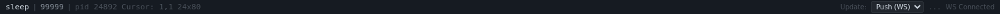

# Bottom Bar

The bottom bar displays status information about the selected command and the connection to the vrw server. It is hidden by default and can be toggled via the **Status** button in the top bar.

## Elements (left to right)

### Command Label
Shows the name, arguments, and PID of the selected command. The name is displayed in the primary color, arguments in secondary, and PID in muted text. Long labels are truncated with ellipsis. Hover over the label to see the full command string as a tooltip.

### Cursor Position (`Cursor: --`)
Shows the current cursor row and column in the terminal buffer (e.g., `Cursor: 12, 40`). Updated in real time as the cursor moves.

### Terminal Dimensions (`--`)
Shows the current terminal dimensions in rows × columns format (e.g., `80x24`). This reflects the actual PTY size, which may differ from the displayed size if the terminal has been resized.

### SCROLLBACK Indicator
Appears when the terminal view is scrolled up from the bottom of the buffer. It is displayed in yellow to alert you that new output may not be visible.

### Spacer
A flexible spacer that pushes the remaining elements to the right edge.

### Update Mode Select
Controls how the web UI detects VTTY buffer changes:

| Mode | Description |
|------|-------------|
| **Push (WS)** | Server pushes dirty signals via WebSocket. Most efficient, lowest latency. Default mode. |
| **Poll** | Client periodically requests the current terminal state via HTTP. |

The selected mode is persisted to `localStorage` across sessions. Server-configured defaults (fetched from `/api/info`) may override saved preferences.

### Poll Interval
When in **Poll** mode, this field sets the polling interval in milliseconds (50–5000ms, default 500ms). Changes take effect immediately.

### Refresh Throttle
Controls a client-side throttle that limits how often VTTY updates are applied to the DOM, even if the server sends them faster. This is useful for reducing CPU usage on slower devices or when real-time updates are not critical.

- **0** (displayed as "off"): No throttle — updates are applied immediately (default).
- **100–2000**: Throttle interval in milliseconds, adjustable in 100ms steps.

This throttle is shared with the per-panel throttle controls in the panel header.

### WebSocket Quality Indicator
Shows the round-trip time (latency) of the **focused panel's** WebSocket connection in milliseconds, measured via periodic ping/pong messages (every 10 seconds). Each panel maintains its own independent latency measurement (`wsLatency` on the panel's state object), so the indicator reflects the connection quality of whichever panel is currently focused. Hover over it for a tooltip with detailed connection statistics.

The quality indicator uses color coding to communicate connection health at a glance:

| Latency | Color | Meaning |
|---------|-------|---------|
| < 50ms | Green | Excellent — local or low-latency connection |
| 50–200ms | Yellow | Acceptable — remote or lightly loaded connection |
| > 200ms | Red | Degraded — high latency or congested connection |

When switching focus between panels, the quality indicator updates to reflect the newly focused panel's connection statistics. If the focused panel has no active WebSocket (e.g., an empty panel with no command selected), the indicator shows "--".

### Connection Status
Shows the current connection state of the **focused panel's** server. Displays **Connected** with latency (e.g., "Connected (5ms)"), **Reconnecting...**, **WS Disconnected**, **WS Error**, or **Command ended**. When the connection is lost, a disconnected overlay appears on the terminal panel and a warning banner appears in the sidebar. The connection status is per-panel — switching focus updates the status to reflect the newly focused panel's server connection state.
