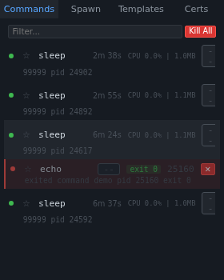
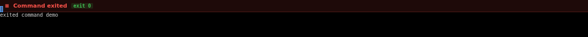
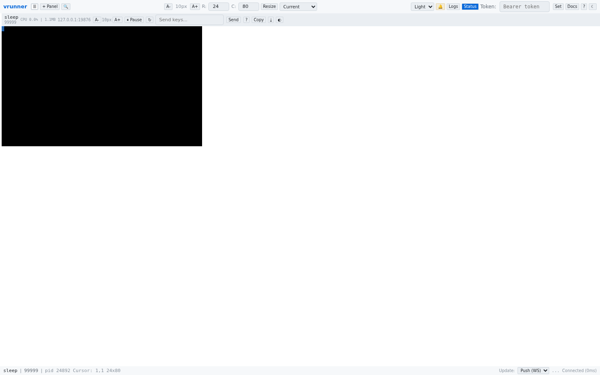

# Command States

Commands in the sidebar go through several states during their lifecycle. Each state has a distinct visual appearance.

## Running State

| Indicator | Appearance |
|-----------|------------|
| Status dot | Green circle |
| Background | Normal (transparent) |
| Badges | Runtime badge visible |
| Kill button | Red `✕` |

The command is actively running and producing output. The runtime badge shows elapsed time.

## Frozen/Paused State

| Indicator | Appearance |
|-----------|------------|
| Status dot | Yellow circle |
| Background | Subtle yellow tint |
| Badges | `PAUSED` badge visible |
| Kill button | Red `✕` |

The command has been suspended via SIGSTOP. It consumes no CPU but remains in memory. Use the **Pause/Resume** button in the panel header to resume it.

## Exited State

| Indicator | Appearance |
|-----------|------------|
| Status dot | Red circle |
| Background | Subtle red tint |
| Opacity | Reduced (0.6) |
| Badges | Exit code badge (green for 0, red for non-zero) |
| Banner | Red "Command exited" banner above terminal |

When a command exits, its terminal output remains visible (read-only), and a red banner appears above the terminal area showing the exit code. The banner uses distinct colors: green for exit code 0 (success) and red for non-zero (failure).

### Retained vs. Purged

By default, exited commands are automatically purged from the manager after their exit timeout expires. Commands spawned with `retain_on_exit: true` are kept in the list until manually purged via the context menu.

## Collapsed Sidebar

When the sidebar is collapsed, all sidebar content is hidden. The command list, spawn form, templates, environment presets, and certificates are all inaccessible until the sidebar is expanded. The toggle button in the top bar or the sidebar resize handle can be used to expand it.
