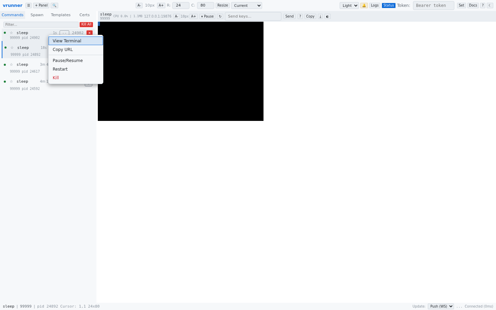

# Context Menu

Right-clicking on a command in the sidebar opens a context menu with additional actions for that command. Right-clicking the panel header opens a separate panel context menu.

## Command Context Menu (sidebar)

Right-click any command in the sidebar command list to see these options:

### View Terminal
Selects the command and switches to its terminal panel. Equivalent to clicking the command in the sidebar.

### Copy URL
Copies the web URL for the command to the clipboard. The URL uses the command name path format (e.g., `http://127.0.0.1:9090/admin/htop`).

### Pause/Resume
Toggles the command between paused (SIGSTOP) and running (SIGCONT) states. When paused, the command's CPU usage drops to zero and its terminal output stops updating. The menu item label changes based on the current state.

### Restart
Restarts the command with the same configuration (command, arguments, working directory, environment). The restart is atomic — the new command is spawned before the old one is killed.

### Kill
Terminates the selected command. Equivalent to clicking the red kill button (`✕`) in the command list.

### Keep/Unkeep
Toggles the retain-on-exit flag for the command. When kept (filled star `★`), the terminal buffer is retained after the command exits instead of being removed. The button is green when active.

### Purge (exited commands only)
Permanently removes an exited command from the manager. This discards the VTTY buffer and all associated state. Only available for commands that have already exited.

## Panel Context Menu (panel header)

Right-click the panel header bar to see panel-specific options:

| Action | Description |
|--------|-------------|
| **Copy URL** | Copies the web URL for the currently selected command |
| **Pause/Resume** | Toggles SIGSTOP/SIGCONT for the selected command |
| **Restart** | Restarts the selected command |
| **Kill** | Terminates the selected command |
| **Share Terminal...** | Opens the share modal to create a real-time view-only or interactive link for the terminal. See [Terminal Sharing](../share-viewer.md) for full details. |
| **Open in New Tab** | Opens a clean, fullscreen viewer for this terminal in a new browser tab. Full keyboard access is enabled. The viewer token expires after 1 hour. |
| **Rename Panel** | Opens an inline text editor on the panel header to rename it |
| **Minimize/Restore Panel** | Collapses or expands the panel (only when multiple panels exist) |
| **Split Horizontal** | Splits the panel into two side-by-side sub-panes (shortcut: `Alt+-`) |
| **Split Vertical** | Splits the panel into two stacked sub-panes (shortcut: `Alt+\|`) |
| **Remove Split** | Removes the split and returns to a single-pane view (shortcut: `Ctrl+A Ctrl+D`) |
| **New Window** | Creates a new window in the multi-window layout (shortcut: `Alt+w`) |
| **Close Window** | Closes the active window (only when multiple windows exist) |
| **Remove Panel** | Removes this panel from the display (multi-instance only) |

## Keyboard Navigation

Both context menus support keyboard navigation:
- **↑** / **↓** to move between items
- **Enter** to activate the selected item
- **Escape** to close the menu
- Tab focus is trapped within the menu while it is open

The context menu can also be opened via keyboard with **Shift+F10** or the **ContextMenu** key when a command item or panel header is focused.
