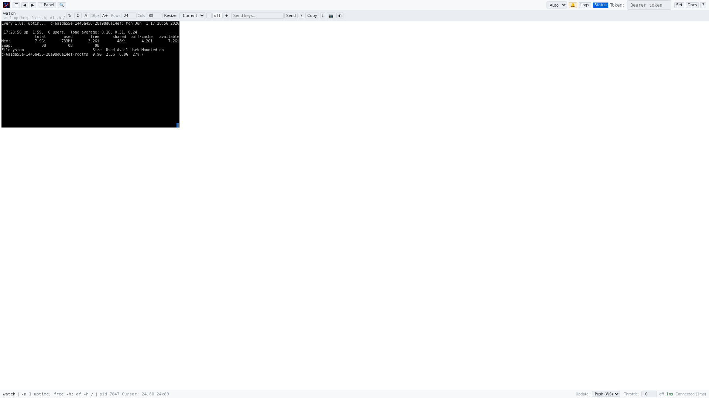

# Web UI Introduction

The vrw web UI is a browser-based control plane for managing terminal commands. It provides a real-time view of command output, interactive keyboard input, multi-instance panel support, and comprehensive command lifecycle management — all accessible from any web browser.

## Accessing the Web UI

By default, vrw serves the web UI at `http://127.0.0.1:9090/admin`. The bind address and port can be configured via CLI flags (`--bind`, `--port`) or the configuration file. If the `--remote` flag is used, the server binds to `0.0.0.0` and requires authentication.

## Layout Overview

The web UI is divided into four main regions:

| # | Region | Description |
|---|--------|-------------|
| 1 | **Sidebar** | Command list, spawn form, templates, and certificate management |
| 2 | **Top Bar** | Global controls: theme, font size, terminal resize, search, tokens |
| 3 | **Panel Header** | Per-panel controls: command info, send keys, pause/resume, copy |
| 4 | **Terminal (VTTY)** | Real-time terminal output rendered in the browser |
| 5 | **Bottom Bar** | Status information: cursor position, dimensions, connection status |

## Responsive Design

The sidebar can be collapsed or resized by dragging its right edge. On screens narrower than 768px, the sidebar becomes a floating overlay. The terminal automatically adjusts its column/row count to fill available space.

## Technology

The web UI is a single-page application (SPA) embedded into the vrw binary via `rust_embed`. It uses vanilla HTML, CSS, and JavaScript with no external dependencies. Terminal rendering uses a `<pre>` element updated via WebSocket push or HTTP polling.
