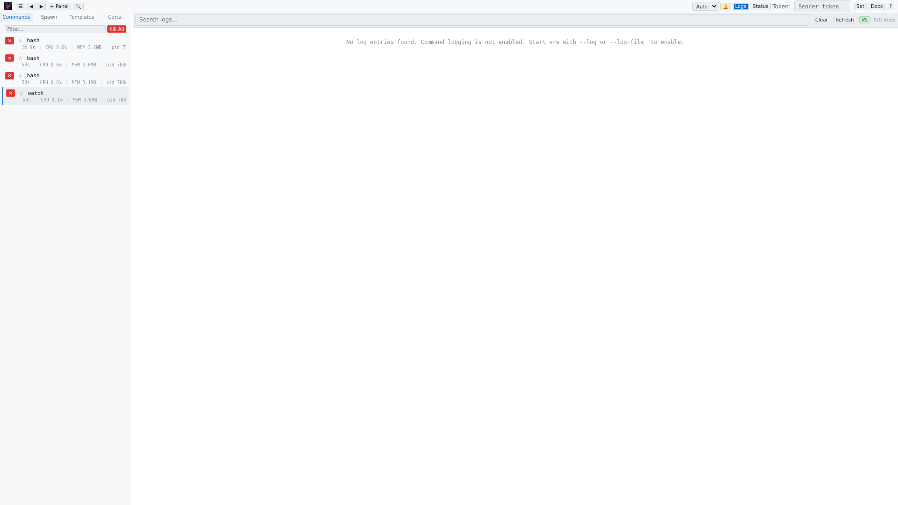

# Log Viewer

The log viewer provides access to vrw's internal event log, showing command lifecycle events, errors, and system messages.

## Opening the Log Viewer

Click the **Logs** button in the top bar. The button highlights in blue when the log viewer is active.

## Toolbar

### Search Input
Filters log entries in real time based on the search query. When a search query is entered, the log viewer switches from WebSocket streaming to a one-time HTTP search to find matching historical entries.

### Clear Button
Clears the search input and restores the live streaming view.

### Refresh Button
Manually refreshes the log content by fetching the latest entries from the server.

### Transport Indicator (`HTTP` / `WS`)
Shows how log data is being received:

| Label | Description |
|-------|-------------|
| **HTTP** | Logs were fetched via a one-time HTTP request (search mode) |
| **WS** (green) | Logs are being streamed in real time via WebSocket |

### Entry Count
Shows the total number of log entries currently displayed.

## Log Entries

Each log entry contains:

| Field | Description |
|-------|-------------|
| **Timestamp** | When the event occurred |
| **Command type** | The event category (e.g., `SPAWN`, `EXIT`, `ERROR`, `KILL`) |
| **Details** | Full event description including command IDs, PIDs, and relevant data |

Log entries related to WebSocket events are shown with a dashed separator line and a green transport indicator.

## Keyboard Shortcut

Press **L** (when no input field is focused) to toggle the log viewer.
