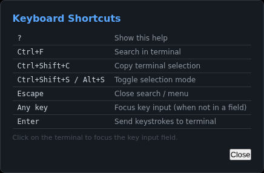
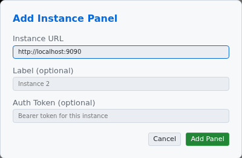
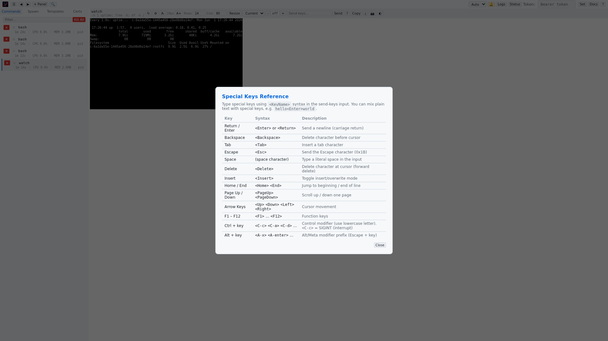

# Modals and Overlays

The web UI uses modals and overlays for focused interactions that require user attention.

## Keyboard Shortcuts Overlay

Displays a reference table of all available keyboard shortcuts in the web UI.

| Shortcut | Action |
|----------|--------|
| `?` | Show this help |
| `Ctrl+F` | Search in terminal |
| `Ctrl+Shift+C` | Copy terminal selection |
| `Ctrl+Shift+S` / `Alt+S` | Toggle selection mode |
| `Escape` | Close search / menu |
| `Alt+Left` / `Alt+Right` | Navigate prev/next command |
| `Any key` | Focus key input (when not in a field) |
| `Enter` | Send keystrokes to terminal |

**Open**: Click the **?** button in the top bar.

## Add Panel Modal

Used to connect to an additional vrw instance in a new panel. This creates both a server connection and an empty panel pre-linked to that server.

### Instance URL
The base URL of the vrw instance (e.g., `http://localhost:9090`).

### Label (optional)
A friendly name for this instance, displayed in the panel header and instance URL field.

### Auth Token (optional)
A bearer token for authenticating with this instance. If omitted, the global token (set in the top bar) is used.

### Split Direction
Controls how the new panel is arranged relative to existing panels:

| Option | Description |
|--------|-------------|
| **Auto** | Stacks panels horizontally if 2 panels, or uses the current layout direction if 3+ |
| **Horizontal** | Places panels side by side |
| **Vertical** | Stacks panels top to bottom |

### Actions
- **Cancel**: Close the modal without adding a panel.
- **Add Panel**: Create the new panel and connect to the specified instance. The connection is added idempotently — if a connection to the same URL already exists, it is reused.

**Open**: Click the **+ Panel** button in the top bar.

## Add Server Modal

Used to register a new server connection **without** creating a panel. This is useful when you want commands from a remote instance to appear in the sidebar command list for all existing panels, without adding another panel to the layout.

### Instance URL
The base URL of the vrw instance (e.g., `http://localhost:9090`).

### Label (optional)
A friendly name for this instance, displayed in the sidebar's instance headers and sort bar.

### Auth Token (optional)
A bearer token for authenticating with this instance.

### Open pane connected to this server
A checkbox (checked by default). When checked, adding a server also creates a new panel and connects it to the server's main command (the command that was launched on the command line, identified as `spawn_order` 0). If the server has no main command, the first spawned command is shown instead. If the server has no commands at all, an empty panel is created focused on the server. Unchecking this option adds the server connection without opening a panel (original behavior).

### Actions
- **Cancel**: Close the modal without adding a connection.
- **Add Server**: Register the connection. Commands from this instance appear in the sidebar's Servers tab for all panels. If the "Open pane" checkbox is checked, a new panel is created and connected to the server's main or first command.

**Open**: Click the **+ Server** button in the sidebar header.

## Command Picker Modal

When the URL contains a command name that matches multiple running commands (e.g., `/admin/bash` when multiple bash instances are running), a picker overlay appears. Each matching command is listed with its name, PID, alive/exited status, and runtime. Click a command to view its terminal, or click **Cancel** to dismiss.

The picker supports keyboard navigation: Tab and Shift+Tab cycle through the command items, and Escape closes the picker.

## Special Keys Help Modal

Displays a comprehensive reference for typing special keys in the send keys input field. See [Special Keys Reference](./special-keys.md) for the full listing.

**Open**: Click the **?** button next to the send keys input in any panel header.

## Global Search Overlay

See [Global Search](./global-search.md) for details.

**Open**: Click the **🔍** button in the top bar.

## Share Terminal Modal

Opened from the panel context menu (**Share Terminal...**). This modal creates a URL that lets anyone view a terminal in real-time through a standalone viewer page.

### Configuration Options

| Option | Description |
|--------|-------------|
| **Allow viewers to type (interactive)** | When checked, viewers can send keystrokes, paste text, and resize the terminal. When unchecked (default), the share is read-only. |
| **Expires in** | How long the share link remains valid: 1 hour, 4 hours, 24 hours (default), 3 days, 1 week, or never. |

### Flow

1. Click **Create Link**. The server generates a UUID v4 token and stores it in memory.
2. The full URL is displayed in a read-only input field (e.g., `https://your-server/share/a1b2c3d4-...`).
3. Click **Copy** to copy the URL to the clipboard.
4. Send the URL to your teammate. They open it in any browser — no login required.

The viewer connects via a dedicated WebSocket (`/api/share/:token/ws`). See [Terminal Sharing & Viewer](../share-viewer.md) for the full protocol and security model.

**Open**: Right-click a panel header → **Share Terminal...**.

## Focus Management

All modals implement focus trapping: while a modal is open, the Tab key cycles through the modal's interactive elements and cannot escape to the page behind it. Pressing Escape closes the modal and restores focus to the previously active element.
