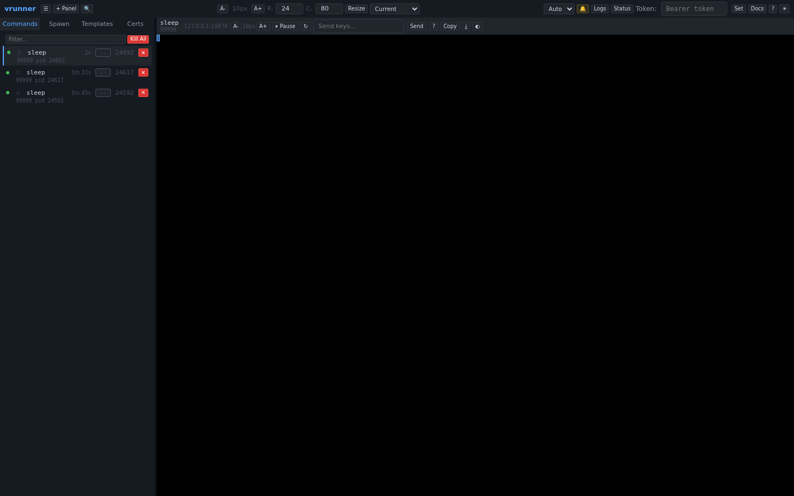

# Overview

The vrw web UI is the primary interface for interacting with running commands. It displays real-time terminal output, provides controls for sending keystrokes, and manages the full command lifecycle from spawn to termination.

## Screenshot

## Key Features

- **Real-time terminal display**: View command output as it happens, with support for ANSI escape codes and full-color rendering
- **Multi-instance panels**: View commands from multiple vrw instances side by side in resizable panels
- **Interactive keyboard input**: Send keystrokes, special keys, and multi-line input to any running command
- **Command lifecycle management**: Spawn, pause, resume, restart, and kill commands from the browser
- **Search**: Search across all command output or within a single terminal buffer
- **Theming**: Three built-in themes (dark, light, grey) with automatic OS preference detection
- **Persistent settings**: Font size, theme, sidebar visibility, and auth tokens are saved to `localStorage`
- **WebSocket and HTTP transport**: Terminal updates can be pushed via WebSocket or polled via HTTP
