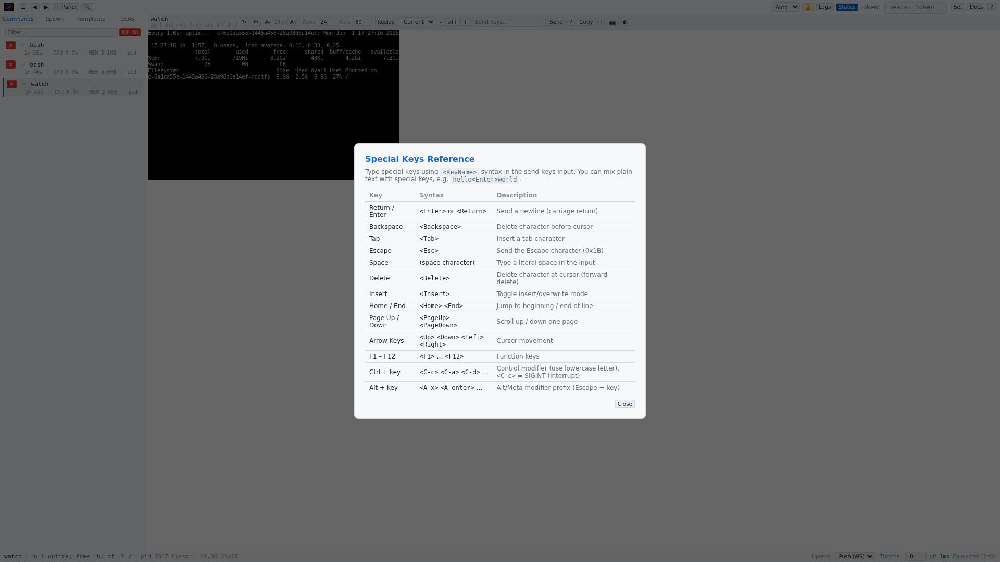

# Panel Header

The panel header appears above each terminal view and contains per-panel controls for managing the selected command. When multiple panels are open (multi-instance mode), each panel has its own header.

## Elements

### Drag Handle (`⠿`)
Visible only when multiple panels are open. Drag this handle to reorder panels horizontally. The panel being dragged shows a reduced opacity, and drop zones are indicated by colored border highlights on adjacent panels.

### Command Info
Displays the full command name and arguments of the currently selected command. The command name uses a monospace font and is truncated with an ellipsis if it exceeds the available width. The arguments appear below in a smaller, muted font.

### Restart Button (`↻`)
Restarts the selected command by re-spawning it with the same command, arguments, working directory, and environment variables. The restart is atomic — the new command is spawned before the old one is killed, preventing the server from shutting down if it was the last running command.

### Resource Toggle (`⚙`)
Toggles the visibility of resource badges (CPU and memory) in both the panel header and the sidebar command list. When enabled, real-time CPU percentage and memory usage are displayed for each running command. This data is polled from the server in parallel for all commands.

### Resource Badge
Shows real-time CPU percentage and memory usage for the selected command (e.g., `CPU 2.3% | 14.5MB`). Only visible when the resource toggle is enabled.

### Instance URL
Shows the URL of the vrw instance this panel is connected to. Truncated if too long. Only visible when the resource toggle is enabled.

### Panel Font Size (`A-` / `10px` / `A+`)
Adjusts the font size for this specific panel only, independent of the global font size setting. Each panel's font size is saved to `localStorage` with its own key. Range: 8px to 28px.

### Terminal Resize (`Rows` / `Cols` / `Resize`)
Manually set the terminal dimensions (rows and columns) for the selected command's PTY. Enter the desired values and click **Resize** to send a `SIGWINCH` signal to the running process.

### Buffer Select (`Current` dropdown)
Switches which terminal buffer is displayed in the selected panel:

| Option | Description |
|--------|-------------|
| **Current** | Shows the active buffer (main or alternate, depending on what the application is using) |
| **Main** | Forces display of the main screen buffer |
| **Alt** | Forces display of the alternate screen buffer (used by full-screen apps like htop, vim) |

### Refresh Throttle (`-` / `off` / `+`)
Controls how often terminal display updates are applied to the DOM. In push mode (the default), the server sends updates as fast as the terminal changes. The throttle allows you to reduce this rate to save CPU or battery when real-time updates are not critical.

- **`-`** button decreases the throttle interval by 100ms.
- **`+`** button increases the throttle interval by 100ms.
- **`off`** means no throttle — updates are applied immediately (default).
- **Range**: 0 (off) to 2000ms in 100ms steps.
- Changes take effect immediately and are persisted to `localStorage`.

When the throttle is active, the client buffers incoming VTTY updates and applies them in batch after the throttle window, fetching the latest state via HTTP.

### Send Keys Input
A text field for typing keystrokes to send to the running command. The input accepts text as-is — typed characters are sent directly to the PTY. Press Enter to send the keystrokes, or click the **Send** button. See [Send Keys](./send-keys.md) for details on typing special keys.

### Send Button
Sends the contents of the send keys input field to the selected command's PTY. Equivalent to pressing Enter in the input field.

### Help Button (`?`)
Opens the special keys reference modal, which explains how to type special keys (Return, Backspace, Escape, arrow keys, etc.) in the send keys input field. See [Special Keys Reference](./special-keys.md).

### Remove Panel Button (`✕`)
Visible only when multiple panels are open. Removes this panel from the display. The underlying vrw instance is not affected.

### Copy Button
Copies any selected text in the terminal to the clipboard.

### Export Button (`⤋`)
Exports the entire terminal buffer as plain text. This includes the full scrollback buffer, not just the visible portion.

### Screenshot Button (`📷`)
Downloads a PNG screenshot of the current terminal output. The server renders the terminal buffer to a PNG image at the configured resolution and sends it to the browser for download.

### Panel Theme Button (`◯` / `☾` / `☀`)
Cycles the terminal area's theme through: inherit from global → light → dark → inherit. This allows having a dark UI with a light terminal (or vice versa), which is useful for readability. The selected theme is persisted per panel in `localStorage`.

## Panel Context Menu

Right-clicking the panel header opens a context menu with additional actions:

| Action | Description |
|--------|-------------|
| **Copy URL** | Copies the web URL for the currently selected command to the clipboard |
| **Pause/Resume** | Toggles SIGSTOP/SIGCONT for the selected command (freeze/thaw) |
| **Restart** | Restarts the command with the same configuration |
| **Kill** | Terminates the selected command |
| **Remove Panel** | Removes this panel from the display (multi-instance only) |

## Terminal Switching

When you switch to a different command (by clicking in the sidebar, using prev/next navigation, or spawning a new command), the terminal display is cleared immediately before the new command's output is loaded. This ensures only the active command's output is visible in the terminal area at any time.
