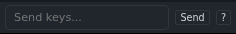

# Send Keys

The send keys input area is located in the panel header and provides a way to send keystrokes to the selected command's PTY from the web browser. This is essential for interacting with commands that require input (e.g., answering prompts, entering passwords, navigating menus).

## Elements

### Input Field
A text field where you type the characters to send to the command. Characters are sent to the PTY exactly as typed — there is no line buffering or echo in the web UI itself. The command's own output will show what was received.

To send the typed text, press **Enter** or click the **Send** button.

### Send Button
Sends the contents of the input field to the selected command. The input field is cleared after sending.

### Help Button (`?`)
Opens the special keys reference modal. This explains how to type special keys that cannot be entered directly via the keyboard (e.g., arrow keys, function keys, control combinations). See [Special Keys Reference](./special-keys.md) for the full reference.

## Typing Special Keys

Special keys are entered using a backslash notation in the input field:

| Notation | Key |
|----------|-----|
| `\n` or `\r` | Return / Enter |
| `\t` | Tab |
| `\b` or `\x08` | Backspace |
| `\e` or `\x1b` | Escape |
| `\x7f` | Delete |
| `\x00` | NUL |
| `\x03` | Ctrl+C (SIGINT) |
| `\x04` | Ctrl+D (EOF) |
| `\x1a` | Ctrl+Z (SIGTSTP) |
| `\x1c` | Ctrl+\\ (SIGQUIT) |

Arrow keys and function keys follow `\x1b` prefix notation:

| Notation | Key |
|----------|-----|
| `\x1b[A` | Up arrow |
| `\x1b[B` | Down arrow |
| `\x1b[C` | Right arrow |
| `\x1b[D` | Left arrow |
| `\x1bOP` | F1 |
| `\x1bOQ` | F2 |
| `\x1b[15~` | F5 |
| `\x1b[17~` | F6 |

Click the **?** button to see the full reference within the web UI.
