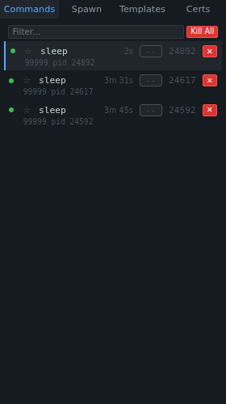
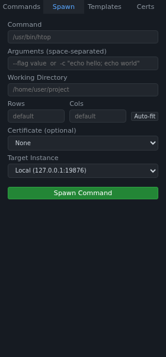
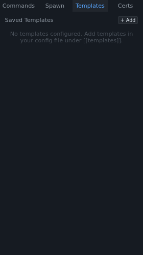
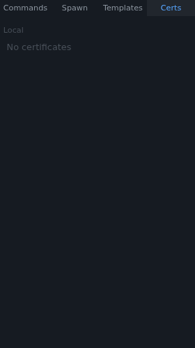

# Sidebar

The sidebar provides the primary navigation for managing commands. It contains four tabs, each serving a distinct purpose: command management, spawning new commands, saved templates, and certificate management.

The sidebar width can be adjusted by dragging the resize handle on its right edge (minimum 150px, maximum 600px). It can also be fully collapsed via the toggle button in the top bar.

## Commands Tab

### Filter Input
A text filter that narrows the command list in real time. Matches against command names, arguments, and PIDs. As you type, only matching commands remain visible.

### Kill All Button
Terminates all running commands across all instances. This button uses the danger style (red background) to indicate its destructive nature. It sends a kill signal to every active command managed by the connected instance(s).

### Command List Items
Each command in the list uses a two-row layout. The first row shows the primary identification; the second row shows live status information:

**Row 1 (name row):**

| Element | Description |
|---------|-------------|
| **Kill button** (`✕`) | Kills the individual command. Always visible even when sidebar is narrow |
| **Pin button** (`☆`) | Pins/unpins a command to keep it at the top of the list |
| **Command name** | The name of the running command, truncated with ellipsis if too long |
| **Certificate badge** | Shows the bound certificate name or `--` if none |
| **Exit badge** | Shows the exit code (green for 0, red for non-zero) |

**Row 2 (detail row):**

| Element | Description |
|---------|-------------|
| **Runtime** | Shows elapsed time (e.g., `5m 30s`) for running commands |
| **CPU** | Real-time CPU usage percentage (e.g., `CPU 12.5%`) |
| **MEM** | Real-time memory usage (e.g., `MEM 45.2MB`) |
| **PID** | Process ID of the child command |
| **Status** | `PAUSED` for frozen/paused commands |

Detail items are separated by `|` and rendered in a smaller, muted font. The detail row is indented to align with the command name. Resource data (CPU, memory) is polled from the server every 2 seconds via `/api/commands/{id}/resources`.

The filter and kill-all toolbar at the top of the commands tab is automatically hidden when no server is reachable or when there are no running commands.

Clicking a command selects it and displays its terminal output in the main panel area. Right-clicking opens a context menu with additional actions.

### Command States
- **Running**: Green status dot, normal background, runtime badge visible
- **Frozen/Paused**: Yellow status dot, `PAUSED` badge, tinted background
- **Exited**: Red status dot, red-tinted background, exit code badge, reduced opacity

See [Command States](./command-states.md) for detailed screenshots and explanations.

## Spawn Tab

The spawn form allows you to create new commands with full control over all options.

### Command Field
The executable to run (e.g., `/usr/bin/htop`, `bash`, `npm`). Pressing Enter in this field triggers the spawn action.

### Arguments Field
Space-separated arguments passed to the command. For complex arguments, use shell quoting: `-c "echo hello; echo world"`. Pressing Enter triggers the spawn action.

### Working Directory Field
The directory in which the command will be executed. Defaults to vrw's working directory if left empty. The server validates that the directory exists before spawning.

### Rows / Cols Fields
Set the initial terminal dimensions for the new command. Leave empty to use the server defaults (typically 24 rows × 80 cols).

### Auto-fit Button
Calculates the optimal terminal dimensions based on the current panel container size. It estimates character dimensions from the current font size and computes how many rows and columns fit. The result is shown in the **Auto-fit hint** below the fields.

### Certificate Dropdown
Select an optional named certificate to bind to the command. Certificate-bound commands require the matching certificate for API access. See the Certificates tab for managing certificates.

### Target Instance Dropdown
When multiple vrw instances are connected, this dropdown lets you choose which instance will run the new command.

### Spawn Command Button
Submits the form and creates the new command. The button uses the primary style (green background) to indicate it's a creation action.

## Templates Tab

Templates let you save and reuse common command configurations. Instead of re-typing the same command and arguments each time, you can save a template and spawn from it with one click.

### Template List
Displays all saved templates as cards. Each card shows the template name and command. Clicking a template card immediately spawns that command with the saved configuration.

### + Add Button
Opens the template creation form with fields for name, command, and arguments.

### Template Card Actions
Each template card has a **Use** button (spawns the command) and a **Delete** button (removes the template).

## Certificates Tab

Certificates enable per-command access control. Each certificate is a named token that can be bound to commands at spawn time. API requests must present the matching certificate to interact with certificate-bound commands.

### Certificate List
Shows all configured certificates with their names. Certificates can also be managed via the CLI (`vrw cert` subcommand).
