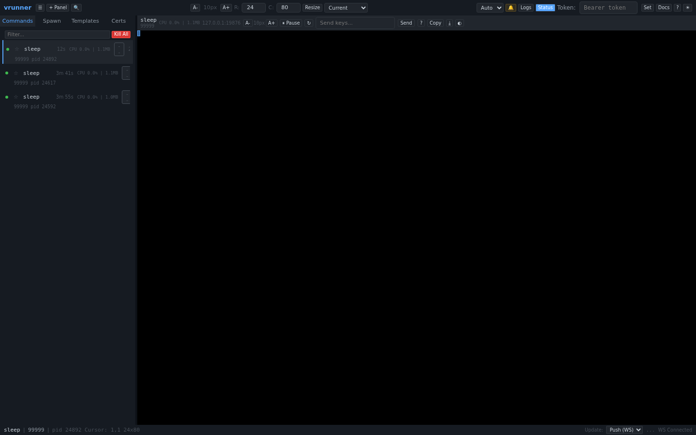
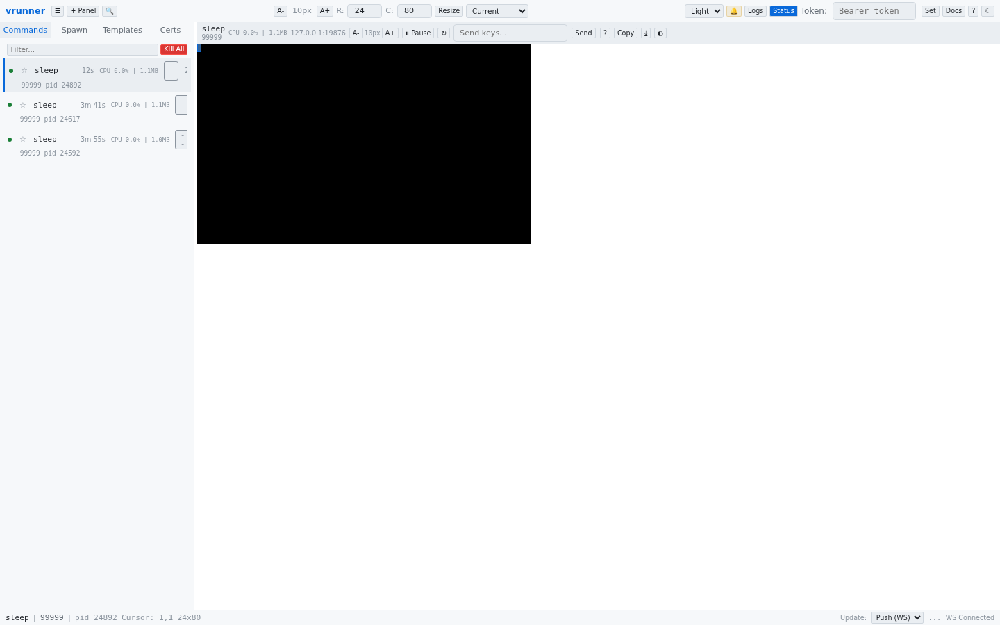
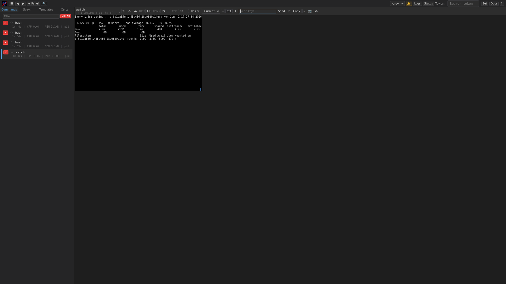

# Themes

The web UI supports four theme modes, allowing you to customize the appearance to your preference.

## Theme Modes

| Mode | Description |
|------|-------------|
| **Auto** | Follows the operating system's `prefers-color-scheme` setting. Switches between dark and light automatically. |
| **Dark** | Dark background with light text. Best for low-light environments. |
| **Light** | Light background with dark text. Best for well-lit environments. |
| **Grey** | VS Code-inspired dark theme with slightly warmer tones. |

## Screenshots

### Dark Theme

### Light Theme

### Grey Theme

## Switching Themes

### Via Dropdown
Use the **Theme** select dropdown in the top bar right group. Choose from Auto, Dark, Light, or Grey.

### Persistence
The selected theme is saved to `localStorage` and persists across page reloads and browser sessions.

## Per-Panel Theme Override

Each terminal panel can have its own independent theme, controlled by the panel theme button (`◯` / `☾` / `☀`) in the panel header. This cycles through:

1. **Inherit** (◯): Use the global theme for the terminal area
2. **Light** (☾): Force a light terminal background
3. **Dark** (☀): Force a dark terminal background
4. **Inherit** (◯): Back to inheriting the global theme

The per-panel theme is persisted in `localStorage` with a panel-specific key. This is useful when you want a dark UI but need a light terminal (for screenshots or readability), or vice versa.
