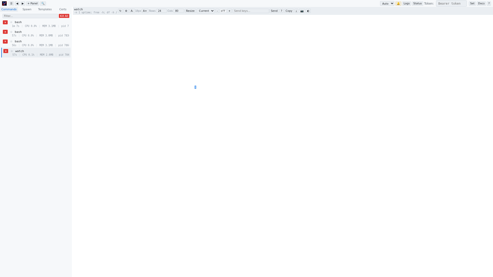

# Top Bar

The top bar contains global controls that affect the entire web UI. It is divided into two groups: left controls and right controls.

## Left Group

### Toggle Sidebar (`☰`)
Collapses or expands the sidebar. The sidebar state persists across page reloads. When collapsed, the sidebar width becomes zero and the terminal area expands to fill the space.

### Previous/Next Command (`◀` / `▶`)
Navigates through the command list without using the sidebar. These buttons cycle through all commands alphabetically, wrapping from last to first and vice versa. Useful when the sidebar is collapsed or for quick keyboard-driven navigation.

### + Panel
Opens a dialog to add a new instance panel. Each panel connects to a different vrw instance, allowing you to monitor commands from multiple servers simultaneously.

### Search Output (`🔍`)
Opens the global search overlay, which searches across all command output buffers. See [Global Search](./global-search.md) for details.

## Right Group

### Theme Select (`Auto` / `Dark` / `Light` / `Grey`)
Selects the color theme for the entire UI. **Auto** follows the operating system's `prefers-color-scheme` setting.

### Sound Notifications (`🔔`)
Toggles audible notifications. When enabled, a bell sound plays when a command exits or produces a bell character (`\a`). The active state is indicated by a yellow highlight on the button.

### Logs
Toggles the log viewer, which shows vrw's internal event log. See [Log Viewer](./log-viewer.md) for details.

### Status
Toggles the bottom status bar, which shows cursor position, terminal dimensions, connection status, and update mode settings.

### Token Field
Enter a bearer token for API authentication. Click **Set** to save the token to `localStorage`. This token is sent with every API request in the `Authorization` header. Required when vrw is started with `--auth` or `--remote`.

### Docs
Opens the built-in documentation view within the web UI.

### Keyboard Shortcuts (`?`)
Opens the keyboard shortcuts reference overlay. See [Keyboard Shortcuts](./shortcuts.md) for the full list.
