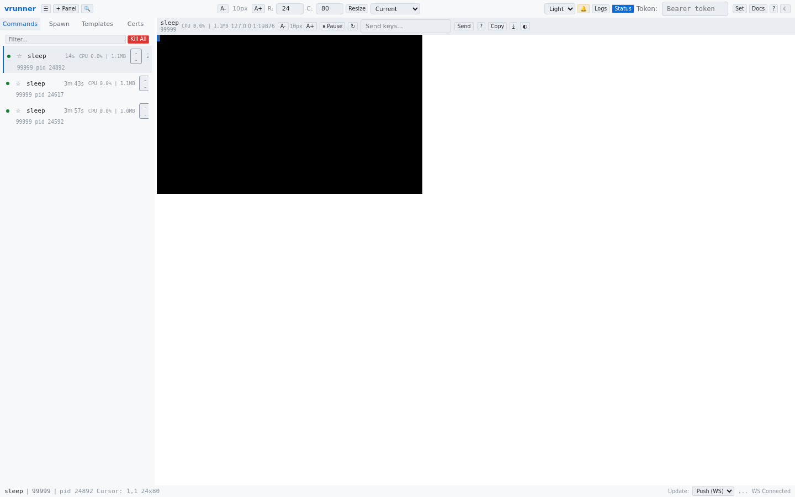

# Welcome Screen

When no commands are running and no command is selected, the web UI displays a welcome screen in the main content area. This screen provides a quick way to spawn your first command.

## Elements

### Heading
Displays the **vrunner** title.

### Description
A brief instruction: "Spawn a command to get started. Your terminal output will appear here."

### Quick Spawn Form
A simple input field where you can type a command path (e.g., `/usr/bin/htop`) and press Enter or click **Spawn Command** to start it immediately. This uses default settings for terminal size and working directory.

### Tips
A list of helpful pointers for getting started:

- Use the **Spawn** tab in the sidebar for advanced options (working directory, terminal size, certificates, environment variables)
- Use **Templates** to save and reuse common command configurations
- Click on a command in the sidebar to view its terminal output
- Press **?** to see keyboard shortcuts

## Transition

The welcome screen automatically disappears when any command is running or selected. If all commands are killed, the welcome screen reappears.
